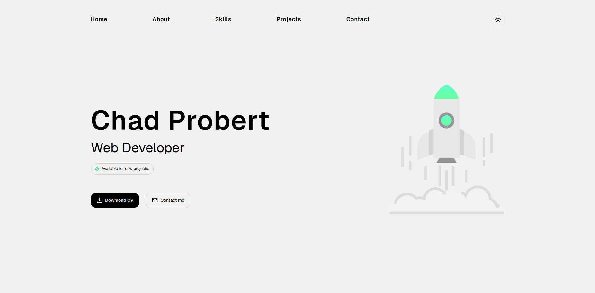
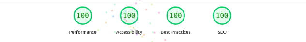

<div align="center">

# My Portfolio

### Tech Stack




</div>

<br />

## Features

- **Home** — Modern, responsive, and includes CTA buttons to download my CV and contact me.
- **About** — Learn about my mission and experience.
- **Skills** — A marquee showcasing my tech skills as icons.
- **Projects** — View my featured projects with live demos and GitHub repository links.
- **Contact** — Send a message directly to my email using EmailJS.
- **Theme** — Switch between light and dark themes.
- **SEO Optimized** — High SEO performance and fast loading times.

<br />

<div align="center">

### Lighthouse Metrics
  

</div>

<br />

## Setup Instructions

### Prerequisites
- **[Node.js](https://nodejs.org/)**
- **[npm](https://www.npmjs.com/)**


### 1. Clone the repository
```bash
git clone https://github.com/ChadProbert/chad-probert-portfolio.git
```

### 2. Install dependencies
```bash
cd chad-probert-portfolio && npm install
```

### 3. Environment variables

Create a `.env.local` file in the project root with the following variables:

```env
NEXT_PUBLIC_EMAILJS_SERVICE_ID = replace_with_service_id
NEXT_PUBLIC_EMAILJS_TEMPLATE_ID = replace_with_template_id
NEXT_PUBLIC_EMAILJS_PUBLIC_KEY = replace_with_public_key
```

### 4. Running the app
```bash
npm run dev
```

### 5. Open in browser
Visit **[http://localhost:3000](http://localhost:3000)** in your browser.
